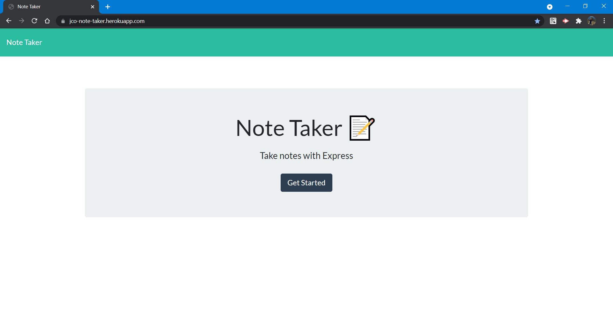
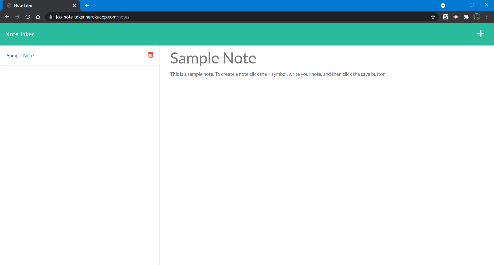

# Note Taker 
A Note Taker

  
## Description
***

 Use the **Note Taker** take notes, plan your day or just to remember something. You just need to add the title of the note and the note itself and then click on the save button. Delete notes as needed.


## Table of Contents
***  

- [Installation](#installation)
- [Usage](#usage)
- [How to Contribute](#How)
- [Tests](#Tests)
- [Questions](#Questions)
- [License](#license)

  
  
## Installation
***

  The installation can be completed by following these instructions:
    
1. To install a Node JS project, install [Node JS](https://nodejs.org/)       

2. Clone the GitHub repository to you local computer. Click on the following link.
 
  * Repository link: https://github.com/jcorozco81/note-taker


Additional packages required:

1. To install additional packages, initialize the repository with a ```package.json``` file by running ```npm init -y```.

[expressjs package](https://www.npmjs.com/package/express). 

2. Install inquirer and add it to the list of dependencies by running ```npm i express```.

[uniqid package](https://www.npmjs.com/package/uniqid). 

3. Install inquirer and add it to the list of dependencies by running ```npm i uniqid --save```.


## Usage
***

1. To execute the script, open a Git terminal on the main project folder (cloned folder) Run the following command: ```node server.js```. Open your browser and access the following website: [Localhost at port 3030](http://localhost:3030/).

    or

    Access the deployed website [Note Taker](https://jco-note-taker.herokuapp.com/notes).

2. When you reach the landing page, click on get started.

    

3. Add notes as required, click on the save button to save the note and on the trash can to delete the note. Enjoy!

    


## How to Contribute
***

  Developers who are interested in contributing ideas for this application must agree to follow and comply with the Contributor Covetnant: Code of Conduct. The Contributor Covenant Code of Conduct can be found in the following address:

  [Contributor Covenant Code of Conduct](https://www.contributor-covenant.org/version/2/0/code_of_conduct/code_of_conduct.md/)


## Tests
***
No test cases were written for this project.


## Questions
***
  
  You can find additional projects on my github page: https://github.com/jcorozco81.

  If you have any questions please contact me at my E-Mail address: jcorozco@gmail.com.


## License
***

Copyright (c) 2021 jcorozco81.


This software/code is licensed under the MIT License; to use this software/code you must agree to follow and comply the License. A copy of the License can be found at:

https://www.mit.edu/~amini/LICENSE.md


